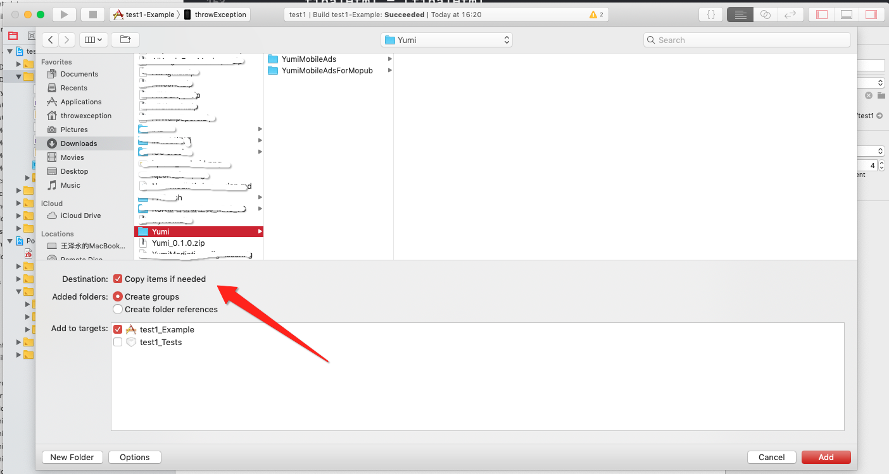
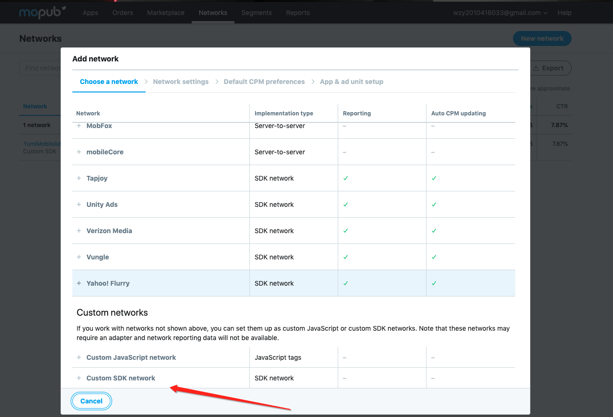
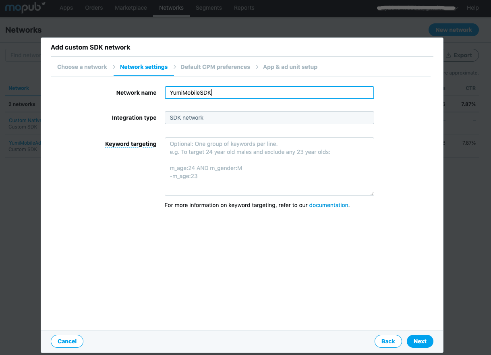

- [How to integrate YumiMobileAds to Mopub Mediation SDK](#how-to-integrate-yumimobileads-to-mopub-mediation-sdk)
	- [iOS](#ios)
		- [1. Cocoapods](#1-cocoapods)
		- [2. Manual](#2-manual)
	- [Android](#android)
		- [1. Gradle](#1-gradle)
		- [2. Manual](#2-manual-1)
	- [Add new custom sdk network in Mopub dashboard](#add-new-custom-sdk-network-in-mopub-dashboard)
	- [Test ID](#test-id)

# How to integrate YumiMobileAds to Mopub Mediation SDK
## iOS
### 1. Cocoapods 
Enter the following line in your podfile:
```ruby
pod 'YumiMobileAdsForMopub'
```
### 2. Manual
1. [DownloadSourceFiles](https://adsdk.yumimobi.com/YumiMobileAds/Yumi_1.0.1.zip)
2. Add source files to your Xcode project.
	Make sure you have selected the `copy item if needed`
	

## Android
### 1. Gradle
### 2. Manual
## Add new custom sdk network in Mopub dashboard
1. Click new network button
	
2. Choose custom sdk network 
	
3. Enter the network name，like YumiMobileAds
	
4. Enter Custom event class and Custom event class data
	- for iOS banner:
		- custom event class should be `MPYumiMobileBannerCustomEvent`
		- custom event class data should be 
			`{ "sspToken":"YOUR_SSPTOKEN", "appID" : "YOUR_APP_ID", "placementID" : "Your_PLACEMENT_ID" }`
	- for iOS interstitial:
		- custom event class should be `MPYumiMobileInterstitialCustomEvent`
		- custom event class data should be 
			`{ "sspToken":"YOUR_SSPTOKEN", "appID" : "YOUR_APP_ID", "placementID" : "Your_PLACEMENT_ID" }` 
	
5. Make sure the network status is running.
	
6. Choose the Segments -> Global Segment
	
7. Make sure the source status is running.
	
8. Final check list
	Apps->Your_App->Your_Ad_Unit_Name-> Ad source 
	make sure the ad source status is running.
	
## Test ID 
SSPToken``EXVTAW2VYMKUY30TBGLUZ3XPC3H2YW6NQHPWBGF6LMNVBTA6LK9YNS6PMJAUNZG=`` 

| OS | APP ID | Slot Format | Slot ID |
| ----- | ----- | ----- | ----- |
| Android | bg76gil7 | banner | an6o1ngv |
| Android | bg76gil7 | Interstitial | 13ohe4ze |
| Android | bg76gil7 | Reawrd Video | dsdibu5j |
| Android | bg76gil7 | Native | 13ur17b0 |
| Android | bg76gil7 | Splash | 50otuc9h |
| iOS | yywtptfq | banner | 5jr45zcy |
| iOS | yywtptfq | Interstitial | n0w2zkex |
| iOS | yywtptfq | Reawrd Video | hmtdjpt4 |
| iOS | yywtptfq | Native | gk8cmfh8 |
| iOS | yywtptfq | Splash | ss03ye17 |