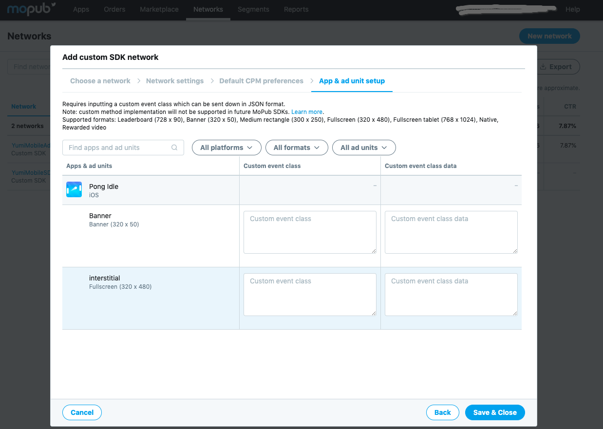
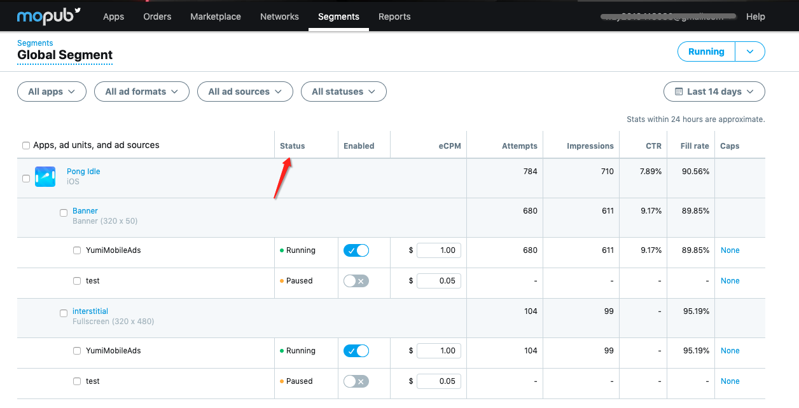

- [Mopub Mediation SDK 接入 YumiMobileAds](#mopub-mediation-sdk-%E6%8E%A5%E5%85%A5-yumimobileads)
	- [iOS](#ios)
		- [1. Cocoapods 接入](#1-cocoapods-%E6%8E%A5%E5%85%A5)
		- [2. 手动接入](#2-%E6%89%8B%E5%8A%A8%E6%8E%A5%E5%85%A5)
	- [Android](#android)
		- [1. Gradle](#1-gradle)
		- [2. Manual](#2-manual)
	- [在 Mopub dashboardnew 中添加 custom sdk network](#%E5%9C%A8-mopub-dashboardnew-%E4%B8%AD%E6%B7%BB%E5%8A%A0-custom-sdk-network)
	- [Test ID](#test-id)


# Mopub Mediation SDK 接入 YumiMobileAds 
## iOS
### 1. Cocoapods 接入
在 podfile 中添加如下代码：
```ruby
pod 'YumiMobileAdsForMopub'
```
### 2. 手动接入
1. [下载源文件](https://adsdk.yumimobi.com/YumiMobileAds/Yumi_0.1.0.zip)
2. 添加源文件到 Xcode 工程.
	确保勾选 `copy item if needed`
	

## Android
### 1. Gradle
### 2. Manual
## 在 Mopub dashboardnew 中添加 custom sdk network 
1. 点击 new network button
	
2. 选择 custom sdk network 
	
3. 填写 network name，例如 YumiMobileAds
	
4. 填写 Custom event class 以及 Custom event class data
	- iOS banner:
		- custom event class 应该为 `MPYumiMobileBannerCustomEvent`
		- custom event class data 应该为
			`{ "sspToken":"YOUR_SSPTOKEN", "appID" : "YOUR_APP_ID", "placementID" : "Your_PLACEMENT_ID" }`
	- iOS interstitial:
		- custom event class 应该为 `MPYumiMobileInterstitialCustomEvent`
		- custom event class data 应该为
			`{ "sspToken":"YOUR_SSPTOKEN", "appID" : "YOUR_APP_ID", "placementID" : "Your_PLACEMENT_ID" }` 
	
5. 确保 network status is running.
	
6. 选择 Segments -> Global Segment
	
7. 确保 source status is running.
	
8. 最终检查
	Apps->Your_App->Your_Ad_Unit_Name-> Ad source 
	确保 ad source status is running.
	
## Test ID 
SSPToken``EXVTAW2VYMKUY30TBGLUZ3XPC3H2YW6NQHPWBGF6LMNVBTA6LK9YNS6PMJAUNZG=`` 

| OS | APP ID | Slot Format | Slot ID |
| ----- | ----- | ----- | ----- |
| Android | bg76gil7 | banner | an6o1ngv |
| Android | bg76gil7 | Interstitial | 13ohe4ze |
| Android | bg76gil7 | Reawrd Video | dsdibu5j |
| Android | bg76gil7 | Native | 13ur17b0 |
| Android | bg76gil7 | Splash | 50otuc9h |
| iOS | yywtptfq | banner | 5jr45zcy |
| iOS | yywtptfq | Interstitial | n0w2zkex |
| iOS | yywtptfq | Reawrd Video | hmtdjpt4 |
| iOS | yywtptfq | Native | gk8cmfh8 |
| iOS | yywtptfq | Splash | ss03ye17 |