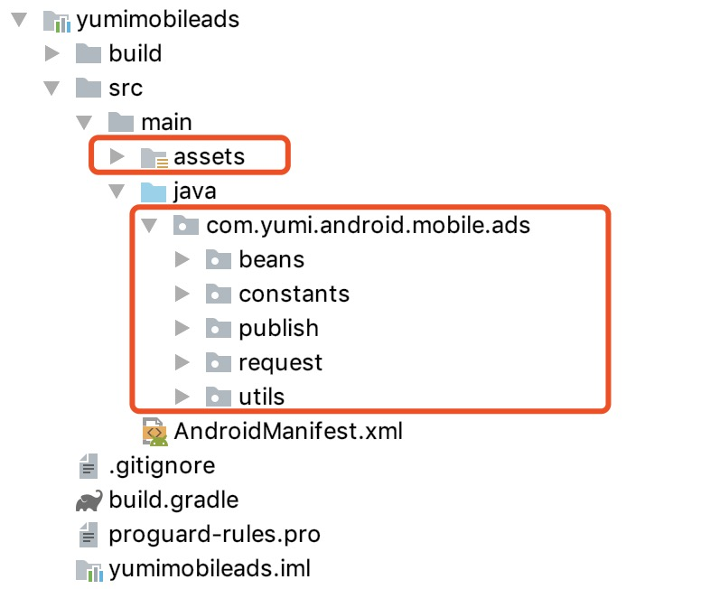
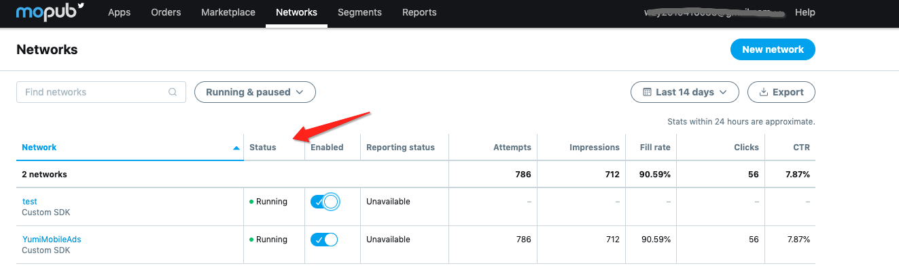

- [Mopub Mediation SDK 接入 YumiMobileAds](#mopub-mediation-sdk-%E6%8E%A5%E5%85%A5-yumimobileads)
	- [iOS](#ios)
		- [1. Cocoapods 接入](#1-cocoapods-%E6%8E%A5%E5%85%A5)
		- [2. 手动接入](#2-%E6%89%8B%E5%8A%A8%E6%8E%A5%E5%85%A5)
	- [Android](#android)
		- [1. Gradle SDK接入步骤](#1-gradle-sdk接入步骤)
		- [2. SDK源码接入步骤](#2-sdk源码接入步骤)
		- [3. 注意事项](#3-注意事项)
	- [在 Mopub dashboardnew 中添加 custom sdk network](#%E5%9C%A8-mopub-dashboardnew-%E4%B8%AD%E6%B7%BB%E5%8A%A0-custom-sdk-network)
	- [Test ID](#test-id)


# Mopub Mediation SDK 接入 YumiMobileAds 
## iOS
### 1. Cocoapods 接入
在 podfile 中添加如下代码：
```ruby
pod 'YumiMobileAdsForMopub'
```
### 2. 手动接入
1. [下载源文件](https://adsdk.yumimobi.com/YumiMobileAds/Yumi_1.0.1.zip)
2. 添加源文件到 Xcode 工程.
	确保勾选 `copy item if needed`
	

## Android
### 1. Gradle SDK接入步骤
**第一步：添加SDK依赖**

```java
//确认 android studio 的 Project 根目录主 build.gradle 中配置了 jcenter 支持。
buildscript {
    repositories {
   	 jcenter()
    }
}
allprojets {
    repositories {
        jcenter()
        maven {
            url 'https://maven.google.com/'
            name 'Google'
        }
    }
}

//在 module 的 build.gradle 中添加依赖
dependencies {
    implementation 'com.yumimobi.ads:yumimobileads:1.0.0'
｝
```
**第二步：请将Android Demo中的Mopub Adapter添加到你的项目中**


**第三步：添加权限**

```xml
    <uses-permission android:name="android.permission.INTERNET" />
    <uses-permission android:name="android.permission.ACCESS_NETWORK_STATE" />
    <!--需要添加此权限去获取设备的imei信息，如果不添加将影响广告收入-->
    <uses-permission android:name="android.permission.READ_PHONE_STATE"/>
```

### 2. SDK源码接入步骤

**第一步：添加SDK资源和源码到你的工程中**

请将Demo中的yumimobileads module的assets目录资源文件和源码添加到你的游戏工程中：


**第二步：请将Android Demo中的Mopub Adapter添加到你的项目中**


**第三步：添加build.gradle依赖**

```java
//确认 android studio 的 Project 根目录主 build.gradle 中配置了 jcenter 支持。
buildscript {
    repositories {
   	 jcenter()
    }
}
allprojets {
    repositories {
        jcenter()
        maven {
            url 'https://maven.google.com/'
            name 'Google'
        }
    }
}

//在 module 的 build.gradle 中添加依赖
dependencies {
    implementation "com.google.android.gms:play-services-ads-identifier:16.0.0"
    implementation 'com.google.code.gson:gson:2.8.2'
    implementation 'com.android.volley:volley:1.1.1'
}
```

**第四步：添加 AndroidManifest.xml配置**
 
请在你工程的AndroidManifest.xml文件中添加下面的配置，用来监听应用下载完成事件：
```java
<receiver android:name="com.yumi.android.mobile.ads.utils.module.receiver.ADReceiver">
	<intent-filter>
		<action android:name="android.intent.action.DOWNLOAD_COMPLETE" />
	</intent-filter>
</receiver>
```

**第五步：添加权限**

```xml
    <uses-permission android:name="android.permission.INTERNET" />
    <uses-permission android:name="android.permission.ACCESS_NETWORK_STATE" />
    <!--需要添加此权限去获取设备的imei信息，如果不添加将影响广告收入-->
    <uses-permission android:name="android.permission.READ_PHONE_STATE"/>
```

### 3. 注意事项

1. Android6.0以上系统权限处理

	当您的应用targetSdkVersion为23及以上时，可选择以下方法进行权限检查并且弹窗提示用户授权。
    
	首先将Demo项目中的CheckSelfPermissionUtils文件，添加到你的工程项目中，如下所示：
	

    在进入游戏时，调用如下接口：
	```java
        CheckSelfPermissionUtils.CheckSelfPermission(this);
	```
	<p><span style="color:red;">注：如果不调用当前接口，就算在AndroidManifest中配置了READ_PHONE_STATE权限，在android设备上也会默认为拒绝当前权限，进入应用时也不会提示用户授权，此方法为可选方法。</span></p>

## 在 Mopub dashboardnew 中添加 custom sdk network 
1. 点击 new network button
	
2. 选择 custom sdk network 
	
3. 填写 network name，例如 YumiMobileAds
	
4. 填写 Custom event class 以及 Custom event class data
	- iOS banner:
		- custom event class 应该为 `MPYumiMobileBannerCustomEvent`
		- custom event class data 应该为
			`{ "sspToken":"YOUR_SSPTOKEN", "appID" : "YOUR_APP_ID", "placementID" : "Your_PLACEMENT_ID" }`
	- iOS interstitial:
		- custom event class 应该为 `MPYumiMobileInterstitialCustomEvent`
		- custom event class data 应该为
			`{ "sspToken":"YOUR_SSPTOKEN", "appID" : "YOUR_APP_ID", "placementID" : "Your_PLACEMENT_ID" }` 

	- Android banner:
		- custom event class 应该为 `com.yumi.api.ads.mopubadapter.YumiMopubAdxBanner`
		- custom event class data 应该为
			`{ "sspToken":"YOUR_SSPTOKEN", "appId" : "YOUR_APP_ID", "placementId" : "Your_PLACEMENT_ID" }`
	- Android interstitial:
		- custom event class 应该为 `com.yumi.api.ads.mopubadapter.YumiMopubAdxInterstitial`
		- custom event class data 应该为
			`{ "sspToken":"YOUR_SSPTOKEN", "appId" : "YOUR_APP_ID", "placementId" : "Your_PLACEMENT_ID" }` 
	
5. 确保 network status is running.
	
6. 选择 Segments -> Global Segment
	
7. 确保 source status is running.
	
8. 最终检查
	Apps->Your_App->Your_Ad_Unit_Name-> Ad source 
	确保 ad source status is running.
	
## Test ID 
SSPToken``EXVTAW2VYMKUY30TBGLUZ3XPC3H2YW6NQHPWBGF6LMNVBTA6LK9YNS6PMJAUNZG=`` 

| OS | APP ID | Slot Format | Slot ID |
| ----- | ----- | ----- | ----- |
| Android | bg76gil7 | banner | an6o1ngv |
| Android | bg76gil7 | Interstitial | 13ohe4ze |
| Android | bg76gil7 | Reawrd Video | dsdibu5j |
| Android | bg76gil7 | Native | 13ur17b0 |
| Android | bg76gil7 | Splash | 50otuc9h |
| iOS | yywtptfq | banner | 5jr45zcy |
| iOS | yywtptfq | Interstitial | n0w2zkex |
| iOS | yywtptfq | Reawrd Video | hmtdjpt4 |
| iOS | yywtptfq | Native | gk8cmfh8 |
| iOS | yywtptfq | Splash | ss03ye17 |